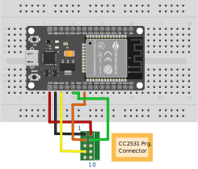

# CC2531 flashing with ESP32
This is tested on the CC2531 USB dongle (TI Development kit) but should be usable for other devices.

### Via Arduino/ESP32
Flashing firmware via Arduino is implemented using the project https://github.com/wavesoft/CCLib and the improved version https://github.com/kirovilya/CCLib
It has been forked and further improved and adapted for the ESP32 here: https://github.com/Larsjep/CCLib-ESP32

The following improvements has been made:

* Adjust delays due to the higher speed of the ESP32
* Change the way the burst write works to allow for high baudrates. (By first writing data to a buffer)
* Increase baudrate to 921600 for faster flashing
* Implement a burst read command to speedup verify

Flashing proccess:
1. Download and unpack the archive with the library https://github.com/Larsjep/CCLib-ESP32.

2. Flashing Arduino sketch via Arduino IDE
CCLib\Arduino\CCLib\Examples\CCLib_proxy\CCLib_proxy.ino

**If needed you can change the pin configuration in Arduino/CCLib/Examples/CCLib_proxy/CCLib_proxy.ino:**

3. Install Python 3.6 or later (tested with python 3.7.1), if not installed

4. Install pyserial 3.4, if not installed
`pip install -r CCLib\Python\requirements.txt`
or
`pip install pyserial==3.4`

5. The ESP32 uses 3.3v so we can connect it directly to the CC2531 as shown below



**Notice: Pin 9 is designed for powering the device from the debugger (the ESP32 in this case) but this requires soldering two pads on the USB dongle. Instead I use pin 2 which also is connected to the 3.3v on the USB dongle. This also means that you shouldn't plug it into the USB port while programming**


6. After that, try to get information about the chip - if it works, then the connection is correct (example for COM7 port - ESP32 port):

```
C:\Work\cc2531\CCLib\Python>python cc_info.py -pCOM7
INFO: Found a CC2531 chip on COM7

Chip information:
      Chip ID : 0xb524
   Flash size : 256 Kb
    Page size : 2 Kb
    SRAM size : 8 Kb
          USB : Yes

Device information:
 IEEE Address : 00124b001936
           PC : 0000

Debug status:
 [ ] CHIP_ERASE_BUSY
 [ ] PCON_IDLE
 [X] CPU_HALTED
 [ ] PM_ACTIVE
 [ ] HALT_STATUS
 [ ] DEBUG_LOCKED
 [X] OSCILLATOR_STABLE
 [ ] STACK_OVERFLOW

Debug config:
 [ ] SOFT_POWER_MODE
 [ ] TIMERS_OFF
 [X] DMA_PAUSE
 [X] TIMER_SUSPEND
```

7. If everything is successful, download and unzip the program file [Zigbee CC2531 USB firmware](https://github.com/Koenkk/Z-Stack-firmware/blob/master/coordinator/CC2531/bin/CC2531ZNP-Prod_20181024.zip)

8. Start the firmware flashing (it takes about 40 seconds):

```
python cc_write_flash.py -pCOM7 -e -i CC2531ZNP-Prod.hex
INFO: Found a CC2531 chip on COM7

Chip information:
      Chip ID : 0xb524
   Flash size : 256 Kb
    Page size : 2 Kb
    SRAM size : 8 Kb
          USB : Yes
Sections in CC2531ZNP-Prod.hex:

 Addr.    Size
-------- -------------
 0x0000   8176 B
 0x1ff6   10 B
 0x3fff0   1 B
 0x2000   239616 B

This is going to ERASE and REPROGRAM the chip. Are you sure? <y/N>:  y

Flashing:
 - Chip erase...
 - Flashing 4 memory blocks...
 -> 0x0000 : 8176 bytes
    Progress 100%... OK
 -> 0x1ff6 : 10 bytes
    Progress 100%... OK
 -> 0x3fff0 : 1 bytes
    Progress 100%... OK
 -> 0x2000 : 239616 bytes
    Progress 100%... OK

Completed
```